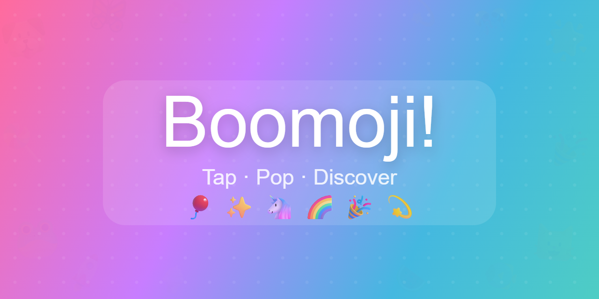

# Boomoji 🎈

A mobile-first PWA emoji toy for little kids. Tap. Pop. Discover.



## Games

### 🎈 Pop

Bouncing emoji balloons float and spin around the screen. Tap one to pop it with a burst of confetti and a satisfying sound. Each round adds one more emoji — how far can you go?

### ✨ Reveal

A dark starfield canvas. Every tap reveals a surprise emoji with a sparkle burst. Swipe to give it momentum — it'll fly across the screen and gently fade away after a few seconds.

### 🌱 Grow

Hold your finger on the emoji to inflate it. The bigger it gets, the louder it hums — until it explodes in a shower of particles. Let go to deflate and try again.

### 🌧️ Rain

Emojis fall from the sky. Tap them before they splat on the ground! The longer you play, the faster they fall.

### 🌟 Stickers

Tap the canvas to place emoji stickers on themed scenes — Animals, Ocean, Yummy, Space, Garden. Fill up 15 stickers to complete a theme and unlock the next one.

### 🧩 Memory

Sixteen face-down tiles hide 8 pairs of matching emojis — all random every game. Tap two tiles to flip them; find the match to keep them revealed. Find all 8 pairs to win!

## Dev

**Requirements:** Node.js (for `npx`)

```bash
# serve locally
npm run dev          # → http://localhost:3000
```

Open on a phone via your local IP (e.g. `http://192.168.x.x:3000`) for the full touch experience. Chrome on Android will offer an "Add to Home Screen" prompt after a few visits.

## PWA icons

The PNG icons aren't tracked in git. To generate them:

1. While the dev server is running, open `http://localhost:3000/icons/generate.html`
2. Three PNGs will auto-download: `icon-192.png`, `icon-512.png`, `apple-touch-icon.png`
3. Move them into `icons/`

The SVG icon (`icons/icon.svg`) is tracked and sufficient for Android PWA installs.

## Caching & offline

The service worker (`sw.js`) uses a **cache-first** strategy: every request is served from the cache; only cache misses hit the network. All JS, CSS, HTML, the manifest, and `icons/icon.svg` are precached on install. The three PNG icons are cached opportunistically — a missing file won't abort installation.

**Deploying an update:** bump the `CACHE` constant in `sw.js` (currently `boomoji-v5`). On next load the new SW installs, old cache versions are purged on activate, and the page reloads automatically to serve fresh assets.

## Project structure

```text
index.html          — menu screen + six game screens
style.css           — animated gradient menu, game backgrounds, overlays
manifest.json       — PWA manifest (portrait, standalone)
sw.js               — service worker (cache-first, versioned cache)
js/
  app.js            — screen routing, fullscreen request, SW registration
  sounds.js         — Web Audio API synth: pop, sparkle, grow, boom, fanfare
  particles.js      — Particle class, spawnBurst(), shuffle(); shared EMOJIS[]
  pop-game.js       — bouncing physics, tap detection, round progression
  reveal-game.js    — starfield, touch/drag/inertia, emoji lifecycle
  grow-game.js      — hold-to-inflate, spring physics, explosion
  rain-game.js      — falling emojis, gravity, splat animation
  stickers-game.js  — themed canvas backgrounds, sticker placement, progression
  memory-game.js    — 4×4 flip grid, pair matching, bounce/glow animations
icons/
  icon.svg          — source icon (tracked)
  generate.html     — open in browser to generate PNG icons
```

## Tech

Vanilla JS · Canvas 2D · Web Audio API · CSS animations · No build step · No dependencies

## License

Copyright (c) 2026 Michael Sanford. All rights reserved. See [LICENSE](LICENSE).
